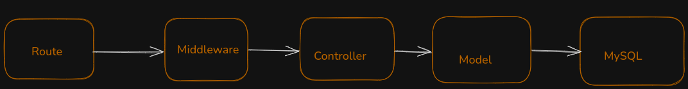

## Using Stack:

1. Express JS
2. RDBMS(MySql)
3. ORM (Sequelize)

## Data flow



## Installation

```bash
$ npm install
```

## Running the app

```bash
$ npm start
```

## API

```bash
# create user (POST)
http://localhost:8080/api/users/create
```

```bash
# login user (POST)
http://localhost:8080/api/users/login
```

```bash
# Create Employee (POST)
http://localhost:8080/api/employee/createEmployee
```

```bash
# Employee Information (hierarchy by position) (GET)
http://localhost:8080/api/employee/:id
```
